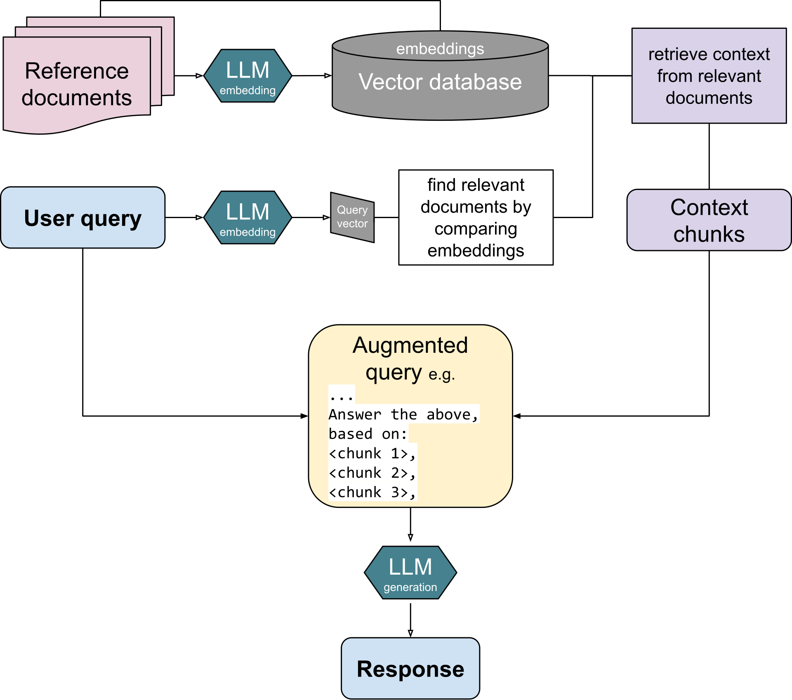

# RAG (Retrieval-Augmented Generation)
- 외부의 데이터 저장소에서 문서를 검색하고, 검색 결과를 기반으로 LLM이 답변을 생성하도록 하는 아키텍처이다.
- RAG는 Non-Parametric Knowledge를 질문 시점에 검색해 모델과 함께 사용한다.  
    - cf. Parametric Knowledge : LLM이 학습 과정에서 가중치 안에 압축시켜둔 지식
- LLM은 학습 시점까지의 데이터만 알고 있고 학습 이후에 생긴 정보나 비공개 데이터는 알 수 없기 때문에 RAG는 질문 시점에 필요한 문서를 검색해 프롬프트에 넣어줌으로써 이러한 한계를 보완한다.

## RAG에서 발생하는 문제
### 1. 관련없는 문서가 검색되는 문제
#### 해결 방법
문서를 나누는 크기 조정, 임보뎅 모델 교체, 하이브리드 검색, Reranking 등을 적용

### 2. Hallucination
#### 해결 방법
프롬프트 강화.  
검색 결과 점수가 너무 낮으면 답변을 만들지 않거나 정보를 찾을 수 없다고 반환하도록 설계.

### 3. 비슷한 내용의 반복
#### 해결 방법
- 검색 결과를 분산해서 뽑는다.  
- 인덱싱 전에 중복 문서를 정리하거나 저장 단계에서 비슷한 조각 제거. 

### 4. 긴 문서에서 앞뒤 맥락이 끊김
#### 해결 방법
- 문서를 나눌 때 앞뒤 내용을 겹치도록 한다.  
- 문서 구조를 잘 반영하여 나눈다.  
- Parent-child chunking : 더 큰 원문 맥락을 함께 가져온다.

## RAG 파이프라인 구성
## Indexing
### 1. Document Loading & Parsing
### 3. Chunking
### 4. Embedding
#### 1) Tokenization
텍스트를 모델이 처리할 수 있는 토큰 단위로 분리하고 정수 ID로 변환하는 과정을 의미한다.

##### 주요 방식
- word : 단어 단위
- subword : 빈도 기반 부분 문자열
- character : 글자 단위

#### 2) Text Embedding
정수 ID를 의미가 반영된 벡터로 변환한다. 비슷한 의미의 텍스트끼리는 벡터 공간에서 가까운 위치에 배치하고, 다른 의미의 텍스트는 먼 위치에 배치한다.  

##### 특징
- 고정 길이 : 벡터를 저장하고 유사도를 검색하려면 모든 벡터의 차원이 같아야 한다.
- 의미 보존 : 비슷한 의미는 가까운 위치에, 다른 의미는 먼 위치에.
- 수치 연산 가능 : 수학 연산으로 텍스트 간 유사도 측정 가능
- 모델 의존적 : 임베딩에 사용한 모델에 따라 결과가 달라진다. 인덱싱과 검색에서 반드시 같은 모델을 사용한다.

### 5. Vector Store

## Query(질의)
### Retrieval
사용자 질문을 벡터화한 뒤, 벡터 저장소에서 유사한 문서 청크를 검색한다.
#### 1. 사용자 입력(쿼리)
#### 2. 임베딩
#### 3. 유사도 검색

### Augmentation
- 검색된 문서 청크를 프롬프트에 삽입하여 문맥을 강화한다. 즉, LLM 입력을 보강한다.
### Generation
- 삽입된 문서를 근거로 답변을 생성한다.