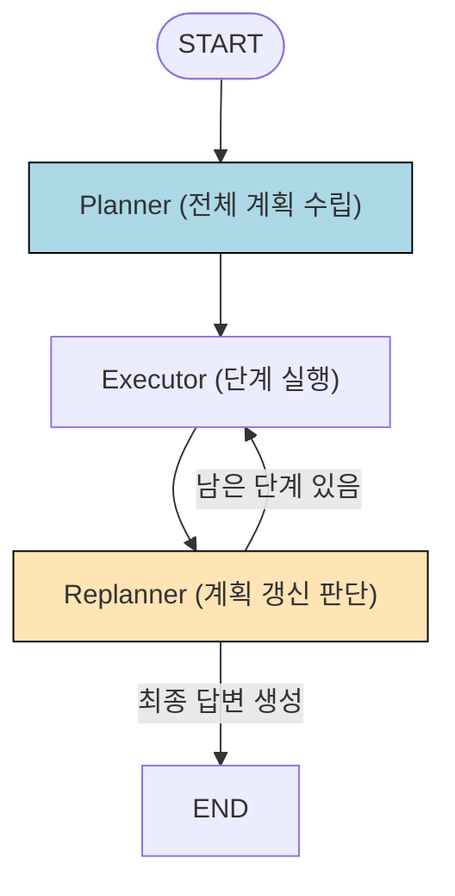
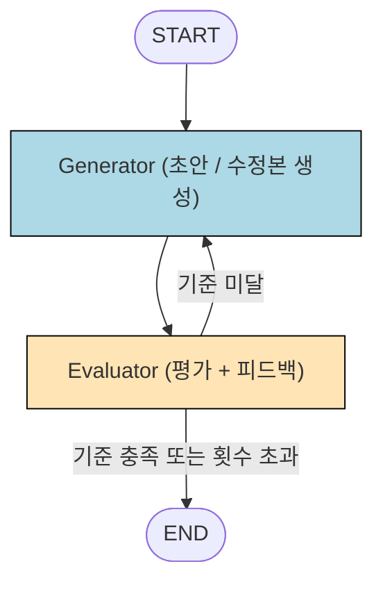
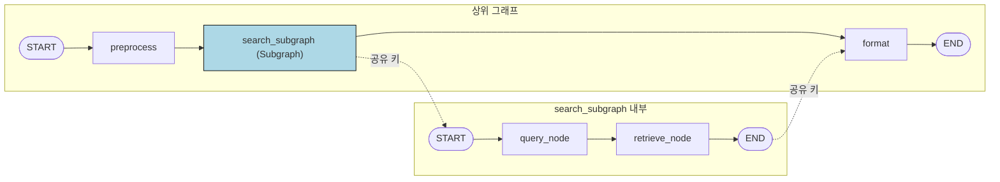
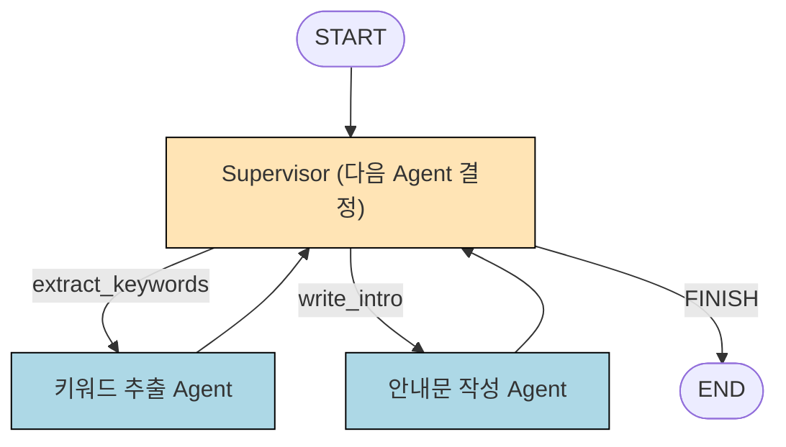

# LangGraph
State, Node, Edge로 구성된 그래프 구조로 설계하고 실행 
- State : 그래프가 실행되는 동안 계속 들고 다니는 데이터
- Node : 실제 작업을 수행하는 단계
- Edge : 어떤 Node로 이동할지 정하는 연결선  

Low-level Orchestration : 개발자가 실행 흐름을 그래프로 직접 설계할 수 있다.  

## 기본 흐름
State 정의 → Node 작성 → Edge 연결 → compile → invoke

## Lang Chain과의 차이점
### Lang Chain : 단순하고 직선적인 흐름  
한 방향 흐름을 빠르게 만들 수 있지만 에이전트를 만들거나 복잡한 워크플로를 만들기 어렵다. 
### Lang Graph : 상태를 유지하면서 흐름이 갈라지거나 반복되는 구조

## LangGraph 방식
### 1. Workflow 방식
개발자가 실행 순서와 분기 조건을 코드로 미리 정의하는 방식  
핵심은 LLM이 전체 실행 순서를 결정하지 않는 것  
#### 장점
실행 경로가 고정되어 있어 예측하기 쉽고 비용 통제, 디버깅이 쉬운 AI 파이프라인 생성이 가능하다.
#### 적합한 대표 시나리오
- RAG 파이프라인
- 문서 처리 자동화
- 데이터 변환 파이프라인
- 사람의 확인이 필요한 흐름

### 2. Agent 방식
LLM이 상황을 판단해서 다음 행동이나 도구 호출을 선택하는 방식
#### 동작 루프 (ReAct)
1. 추론
2. 행동
3. 관찰
4. 재판단 : 종료 또는 추가 행동

#### 적합한 대표 시나리오
- 대화형 어시스턴트
- 멀티스텝 리서치
- 도구 선택이 필요한 업무 자동화
- 문제 해결형 고객 지원

#### 주의 사항
- 실행 경로가 매번 달라질 수 있다.
- 판단 오류가 다음 단계로 연쇄된다.
- 반복 호출로 인해 비용과 응답 지연이 커진다.
- 무한 루프  
    - 해결 : 반복 횟수 제한, 종료 조건, 사람 승인 지점 설계
- 판단 예측 불가
- 프롬프트 인젝션 : 외부 문서나 웹 검색 결과에 악의적 지시가 담아있다면 문제 발생.  
    - 해결 : 시스템 프롬프트와 외부 데이터를 명확히 분리하기, 도구 결과를 무조건 신뢰하지 않는 설계.

#### Tool Node

#### Agent Node


### 3. 실무
Workflow와 Agent 방식을 혼합해서 사용한다. 동적 의사결정이 반드시 필요한 부분만 Agent로 사용

## LangGraph 구현
### StateGraph
상태 스키마를 사용해 그래프를 구축하는 핵심 빌더 클래스이다.

#### Graph State Schema (상태 스키마)
그래프에서 모든 노드가 공유하는 State의 키, 타입, 병합 규칙을 선언한 상태 구조에 대한 정의다.  
즉, State의 키와 타입을 정리하는 설계도로 이해하면 된다.

#### Reducer
특정 상태 키의 업데이트를 기존 값과 어떻게 합칠지 정의하는 함수다.  
Reducer를 사용하면 값이 덮어씌워지지 않고 추가, 누적됨.
```
Annotated[list[str], operator.add]
```

#### MessagesState
##### add_messages
ID 기반 메시지 관리를 지원한다.

##### MessagesState 확장
MessagesState를 상속받아 필요한 필드를 추가한다.

#### Edge
순차 연결 : add_edge
조건부 분기 : add_conditional_edges(소스, [라우팅 함수](), 매핑)
#### Compile
빌더 객체(StateGraph)를 실행 가능한 그래프 객체(CompiledStateGraph)로 변환하는 메서드
##### 파라미터
- checkpointer
- interrupt_before
- interrupt_after
- store
- debug
- name

##### graph.invoke

##### graph.stream

## LangGraph 핵심
### 1) Tool Calling
LLM이 판단하여 호출해야 할 도구의 이름과 인자를 구조화된 형태로 응답에 담아 반환하는 기능이다. 즉, 판단 결과를 구조화된 도구 호출 요청으로 반환.  
호출 요청을 하는 단계이지, 실행하는 단계가 아니다. 이 두 단계를 분리하여 실행 전에 검증할 수 있다.  
`AIMessage`의 `tool_calls` 필드에 담긴다.

#### Tool Node
실제로 도구 함수를 실행하고 결과를 ToolMessage로 감싸서 메시지 리스트에 추가해주는 사전 구성 노드이다.
`ToolNode(tools=tools)`

#### Agent Node
LLM을 호출하여 다음 행동(도구 호출 또는 최종 답변)을 결정한다.

### 2) Routing
다음에 실행할 노드를 선택하는 분기 패턴이다.
#### 라우팅 함수
현재 State를 보고 다음 경로를 선택

### 3) Parallelization & Send
#### Parallelization
서로 의존적이지 않고, 순차적으로 처리될 필요가 없는 작업은 병렬로 처리한다.

##### 병렬노드의 에러 처리

#### Send
생성된 데이터 목록을 기준으로 동일한 노드를 여러번 병렬 실행하도록 지시하는 동적 분기 지시 객체이다.  
응답 시간을 줄이는데 유리하다.

##### Map-Reduce 패턴
- Map: 여러 데이터를 병렬로 처리하는 단계
- Reduce : 병렬 처리된 결과들을 하나로 모으는 단계

#### Parallelization vs. Send
- Parallelization : 그래프를 만들 때 병렬 노드의 개수가 미리 정해진다.
- Send : 실행 중에 만들어진 데이터 개수에 따라 병렬 실행 개수가 달라진다.  
하나의 노드 정의를 여러 개의 실행 인스턴스로 확장하는 방식.  
Map-Reduce 패턴에 사용됨.

### 4) Command
- 상태 업데이트와 함께 다음 실행 노드를ㄹ 하나의 반환값으로 전달할 수 있게 하는 LangGraph 객체이다.  
- Command를 사용하지 않으면 상태를 업데이트 한 후 반환된 상태를 별도의 라우팅 함수가 읽어서 다음 노드를 결정하는 두 단계를 거쳐야 한다.
- Command 객체를 사용하면 별도의 `add_conditional_edges()`가 필요하지 않다.

#### Commnad vs. Conditional Edge
- 차이점: 다음 실행 경로를 결정하는 위치
- Command : 노드 함수 안에서
- Conditional Edge : 별도의 라우팅 함수

### 5) Loop
그래프에서 특정 노드로 돌아가는 순환 경로를 만들어, 종료 조건이 만족될 때까지 반복하게 하는 LangGraph 구조이다.

#### Loop Termination
반복 실행중인 Loop를 정상 종료 조건과 강제 종료 조건으로 설계하는 구조이다. 두 가진 조건을 함께 설계해야 한다.
##### 정상 종료 (Termination Condition)

##### 강제 종료 (Recursion Limit)
- 정해진 실행 한도를 넘기지 않도록 중단 시킨다.  
- 노드 실행 횟수가 아니라 LangGraph의 실행 단위인 super-step 횟수를 센다. 
- super-step : 그래프에서 한 번에 실행되는 노드 묶음
- 사용 예시
    - `config={'recursion_limit: N}`
```python
    # === 강제 한도와 함께 실행 ===
try:
    result = graph.invoke(
        {"count": 0},
        config={"recursion_limit": 25},
    )

    print(result)

except GraphRecursionError:
    print("Loop가 한도에 도달해 강제 종료되었습니다.")
```

### 6) ReAct Pattern 
LLM이 어떤 도구가 필요한지 판단하고, 도구를 실행하고, 그 결과를 바탕으로 다시 판단하는 과정을 반복하는 LangGraph의 기본 에이전트 실행 구조이다.

### Functional API
일반 Python 함수에 데코레이터를 붙여 (`@entrypoint`,`@task`) 함수 호출 흐름을 LangGraph 워크플로우로 실행하는 프로그래밍 인터페이스다.

## LangGraph 고급
### 1) Persistence
그래프의 State을 실행 이후에도 유지하고, 같은 실행 흐름에서 이어 사용할 수 있게 해주는 상태 유지 기능이다.

#### [1] Checkpointer
State을 실행 흐름별로 저장하고 다시 불러와, persistence를 실제로 동작시키는 저장 인터페이스다.
##### Checkpointer가 기반이 되는 기능
- 대화 메모리
- 장애 복구
- Human-in-the-Loop : `interrupt()`
- Time Travel
- 상태 조회와 수정 : `get_state()`, `update_state()`

##### Checkpointer 종류
- `InMemorySaver` : 메모리에 State 저장. 개발 중에 사용
- `SqliteSaver` : 단일 서버 파일 저장
- `PostgresSaver` : 운영 환경의 PostgreSQL 저장

##### 비동기 Checkpointer

#### [2] Thread
- 같은 `thread_id`로 묶인 그래프 실행 흐름이다.
- 그래프에 Checkpointer가 연결되어 있어야 thread가 이전 state를 이어갈 수 있다.
- 기본 구조
```python
graph = builder.compile(checkpointer=checkpointer)

config = {
    "configurable": {
        "thread_id": "user-123"
    }
}

result = graph.invoke(
    input_data,
    config,
)
```

#### [3] Checkpoint
- 그래프 실행 중 특정 시점의 State를 그대로 기록한 것.  
- 각 Thread 안에 저장되는 개별 State 스냅샷이다.

##### 사용방법
- `graph.get_state(config)` : 해당 thread의 가장 최신 Checkpoint 조회
- `graph.get_state_history(config)` : 해당 thread에 저장된 Checkpoint 이력을 조회. 최신 -> 과거
- 특정 체크포인트 시점에서 재실행
```python
history = list(graph.get_state_history(config)) # 이력을 리스트로 수집
target = history[2]                             # A 노드 직후 시점 (count=1)

print(target.values)

# 그 시점에서 그래프 이어 실행
new_result = graph.invoke(None, target.config) # 입력 없이 해당 Checkpoint에서 재개
print(new_result)
```

#### [4] Time Travel
쌓여있는 체크포인트를 바탕으로 그래프 실행을 이어가거나, 다른 입력으로 재실행해 새로운 분기를 만드는 LangGraph 기능이다.

##### 사용방법
```python
# 1. Checkpoint 이력 조회
history = list(graph.get_state_history(config))

# 2. 돌아갈 Checkpoint 선택
target_snapshot = history[선택한_인덱스]

# 3. 선택한 Checkpoint의 State 확인
print(target_snapshot.values)

# 4. 해당 Checkpoint 시점에서 다시 실행
result = graph.invoke(
    new_input_data,
    target_snapshot.config,
)
```

#### [5] Interrupt
- 그래프 실행 중간에 흐름을 의도적으로 일시 중단하고, 상태를 체크포인트에 저장한 뒤 사람의 승인·수정 입력을 받아 같은 지점에서 재개하는 메커니즘이다.
- e.g., 결제, 이메일 발송, DB 삭제 : 실행 전에 사람이 확인해야 하는 작업들

##### 두 가지 방식
1. `compile()` 단계에서 특정 노드의 실행 전후를 중단 시점으로 지정하는 방식
2. 노드 내부에서 직접 `interrupt(...)`를 호출해 사람에게 보여 줄 데이터와 응답 처리 로직을 구성하는 방식

#### [6] Human-in-the-Loop
- Interrupt 와 Checkpointer를 사용해 LangGraph 워크플로우의 책임 지점에 사람의 입력 단계를 배치하는 협업 설계 패턴이다.
- 즉, 자동화된 그래프 실행 흐름 안에 사람이 개입하는 단계를 명시적으로 넣는 방식이다.

##### 사람이 맡는 역할
- 승인
- 수정
- 거부
- 정보 제공

#### [7] Durable Execution
그래프 실행이 중간에 끊겨도 체크포인트에 저장된 State을 기준으로, 같은 흐름을 이어 실행할 수 있게 하는 LangGraph의 실행 모델이다.
##### 핵심 요소
- Checkpointer
- Checkpoint
- Thread

##### 일관성 원칙
- Determinism  
    - 같은 조건에서 다시 실행했을 때 결과가 달라지지 않는다.
    - 같은 입력·State·코드로 다시 실행했을 때, 같은 실행 경로와 결과를 재현할 수 있게 하는 원칙  
    
    (Functional API)
    - 비결정적 작업을 `@entrypoint` 본체에 직접 두지 않고, `@task`같은 별도 실행 단위로 분리한다.
        - 비결정적 작업 : 같은 입력으로 다시 실행해도 결과가 달라질 수 있는 작업  
    
    (Graph API)
    - Determinism이 자동으로 보장되지 않는다.
    - 비결정적 작업을 노드 단위로 최대한 작게 분리하고 Checkpointer와 `thread_id`를 함께 사용해야 한다.

- Idempotency (멱등성)
    - 같은 작업이 여러 번 호출되어도 외부에 미치는 효과는 한 번 실행한 것과 동일하도록 보장하는 성질이다.
    - LangGraph 에서 자동으로 보장하지 않기 때문에 멱등성을 고려하여 설계해야 한다.
    - 사용 방법
        - Idempotency key 설계 : 같은 작업을 식별할 수 있는 안정적인 문자열 설계
        - 처리 이력 저장소를 이용해 기록
        - `멱등성키 조회 → 외부 호출 → 처리 결과 저장`
```python
from langgraph.func import task

# === 처리 이력 저장소 ===
# 실제 운영 환경에서는 DB, Redis 같은 외부 저장소를 사용합니다.
처리이력저장소 = {}

@task
def 멱등호출(멱등성키: str, 입력: dict) -> dict:
    # 1. 같은 멱등성 키로 이미 처리된 결과가 있는지 확인
    기존결과 = 처리이력저장소.get(멱등성키)

    if 기존결과 is not None:
        return 기존결과

    # 2. 처리 이력이 없을 때만 실제 외부 시스템 호출
    결과 = 외부시스템호출(입력)

    # 3. 처리 결과를 저장해 이후 같은 요청을 막음
    처리이력저장소[멱등성키] = 결과

    return 결과
```

- Side Effect 처리
    - 외부 시스템 상태를 바꾸는 작업이 재실행되어도 외부 효과가 중복되지 않게 만드는 LangGraph 설계 원칙이다.

    - Side Effect 예시 작업
        - 메시지 발송
        - 결제, 주문 처리
        - 데이터 변경
        - 외부 API 호출
        - 파일 처리
        - 기록 생성

##### 보상 트랜잭션 (Compensating Transaction)

#### Short-term Memory
- 하나의 Thread 안에서 State을 유지해 다음 호출에서 다시 참조할 수 있게 하는 세션 단위 메모리다.
- 같은 세션 안에서 대화 맥락과 중간 결과를 이어 받아, 멀티턴 응답을 가능하게 하고 에이전트가 연속적인 판단을 가능하게 하기 위해서 사용된다.
- 대화 맥락을 이어주는 임시 작업 공간에 가깝다.  
`checkpointer`
```
graph = builder.compile(
    checkpointer=checkpointer,
)
```

#### Long-term Memory
- Thread 경계를 넘어 유지되는, 같은 사용자 네임스페이스를 통해 여러 대화에서 다시 읽고 쓸 수 있는 장기 메모리다.  
`store`

##### 1. Store
- Long-term Memory를 저장하는 공간
- `InMemoryStore()` 는 메모리 기반 Store
- Store는 체크포인터와 달리 Thread가 바뀌어도 다시 사용할 정보와 장기 기억을 담당한다.

##### 2. *, store 주입
- Long-term Memory를 사용하려면 노드 함수에서 `store`를 주입받아야 한다.
```
def 노드(state: MessagesState, *, store) -> dict:
    ...
```
- `*`는 `store`를 키워드 전용 파라미터로 받겠다는 파이썬 문법
    - State에 들어있는 값이 아니라 LangGraph 런타임이 노드에 따로 주입해 주는 값이다.

##### 3. Name Space
- Store 안에서 정보를 묶는 기준
- 예시  
`{"profile", "user-1234"}` : 이름, 역할, 소속 같은 사용자 기본 정보  
`{"preferences", "user-123"}` : 선호 언어, 응답 스타일, 관심 주제  
`{"facts", "user-123", "service"}` : 서비스나 프로젝트와 관련된 사용자별 사실
- 정보 종류, user_id, 세부 카테고리를 조합하여 설계한다. 너무 넓게도 너무 잘게도 나누면 안된다.
- Checkpointer와 달리 명시적으로 코드를 작성해야 한다.

### 2) Streaming
- 그래프 실행이 끝나기를 기다리지 않고 도중에 만들어지는 결과를 순서대로 받아 보는 방식
- 사용자가 결과를 기다리는 동안 진행 상황을 볼 수 있게 해주는 방식이다.
- Agent 워크플로우에서는 Streaming의 가치가 크다.
    - ReAct 패턴은 추론,도구 호출 단계를 반복할 수 있기 때문에 사용자는 Agent가 무엇을 하는 중인지 알 수 없다.
    - 이 때 Streaming을 이용해 LLM 응답 토큰을 실시간으로 보여줄 수 있다.

#### `stream_mode`
- `updates`
- `values`
- `messages`
- `custom`
- `checkpoints`
- `tasks`
- `debug`
- 여러 모드를 함께 지정할 수 있다.

### 3) Plan-and-Execute Pattern
작업을 시작하기 전에 전체 계획을 먼저 세우고, 그 후 계획을 단계별로 실행하고 필요시 남은 계획을 수정하는 에이전트 설계 패턴이다.

#### 역할
- Planner : 요청을 분석하고 실행 가능한 단계 목록을 만든다.
- Executor : 계획에 적힌 단계를 실행하고 결과를 누적한다.
- Replanner : 실행 결과를 보고 남은 계획에 대한 판단을 내린다.

#### 동작 흐름
1. Plan
- Planner
2. Execute
- Executor + Replanner


### 4) Evaluator-Optimizer Pattern
기준을 충족할 때까지 Generator가 생성한 결과를 Evaluator가 평가·피드백하여 다듬는 루프를 반복하는 에이전트 설계 패턴이다.

#### 역할
- Generator : 초안, 수정본 생성
- Evaluator : 평가, 피드백
- 핵심은 역할 분리이다. 프롬프트를 각각 작성해야 한다.



### 5) Subgraph
독립적으로 정의된 `StateGraph`가 상위 그래프의 하나의 노드로 등록해 사용하는 모듈화 단위다.



#### 공유 키
- 상위 그래프와 Subgraph가 데이터를 주고 받는 기준
- 상위 State와 Subgraph State에 같은 이름으로 존재하는 필드

#### 비공유 키
- Subgraph 안에서만 사용하는 내부 필드

#### 상위 그래프 전용 키
- 상위 그래프 안에서만 사용하는 내부 필드

### 6) Multi-Agent
여러 전문 Agent가 역할을 나누어 협업하도록 만든 LangGraph 시스템이다.  
각 Agent가 자기 역할에 필요한 도구와 프롬프트를 갖기 때문에 도구 선택 범위가 줄어들고 판단이 단순해진다.


이 구조의 핵심은 `Agent`가 작업을 마치면 반드시 `Supervisor`로 돌아온다.

#### 구성 요소
1. 전문 Agent
- 특정 역할에 맞게 설계된 Agent

2. Supervisor
- 어떤 Agent가 다음에 일해야 하는지 결정하는 조율 노드
- 코드 분기 또는 LLM Supervisor

3. 공유 State
- 여러 Agent가 함께 읽고 쓰는 상위 그래프의 State

4. 종료 조건
- 더 이상 호출할 Agent가 없을 때 그래프를 끝내는 기준

#### Handsoff 방식
Supervisor를 다시 거치지 않고 Agent가 다음 Agent를 직접 지정하는 방식이다.  
남용하게 되면 전체 흐름을 추적하기 어렵다.